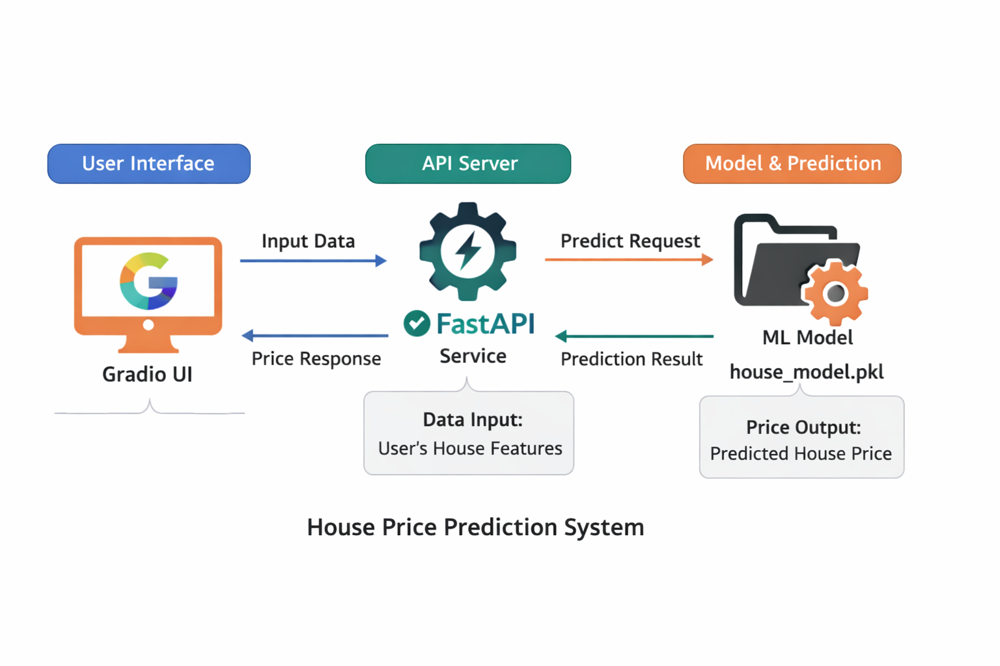

# 🏠 House Price Prediction System  
FastAPI + Gradio + Docker Deployment

This project predicts house prices based on property features using a trained machine learning model.  
It includes:

- 🔹 FastAPI backend (model inference API)
- 🔹 Gradio frontend (user interface)
- 🔹 Docker deployment (Hugging Face Spaces compatible)

---
# Architecture


# 🚀 Features

✅ Machine Learning-based house price prediction  
✅ FastAPI REST API  
✅ Interactive Gradio UI  
✅ Docker-ready deployment  
✅ Hugging Face Spaces compatible  

---

# 📊 Input Features

The model predicts house price based on:

- Square Feet
- Number of Rooms
- Age of House
- Distance to City Center

---

# 🧠 Model

The trained model is stored here:

```

models/house_model.pkl

```

Loaded automatically during API startup.

---

# 📁 Project Structure

```

house-price-prediction/
│
├── app.py                # Gradio UI
├── start.sh              # Startup script
├── Dockerfile            # Docker configuration
├── requirements.txt      # Python dependencies
│
├── app/
│   └── api.py            # FastAPI backend
│
├── models/
│   └── house_model.pkl   # Trained model

```

---

# ▶️ Run Locally (Without Docker)

## Step 1 — Install dependencies

```bash
pip install -r requirements.txt
```

## Step 2 — Start FastAPI

```bash
uvicorn app.api:app --host 0.0.0.0 --port 8000
```

## Step 3 — Start Gradio UI

```bash
python app.py
```

Open:

```
http://127.0.0.1:7860
```

---

# 🐳 Run with Docker

## Build Image

```bash
docker build -t house-price-app .
```

## Run Container

```bash
docker run -p 7860:7860 house-price-app
```

Open:

```
http://localhost:7860
```

---

# 🔌 API Usage

FastAPI endpoint:

```
POST /predict
```

Example request:

```json
{
  "square_feet": 1500,
  "num_rooms": 3,
  "age": 10,
  "distance_to_city": 5
}
```

Example response:

```json
{
  "price": "$325,450",
  "message": "Model prediction output: [[325450]]",
  "model_version": "Neural Network based house price prediction model v1.0"
}
```

---

# 🧪 Test API Using Curl

```bash
curl -X POST http://127.0.0.1:8000/predict \
-H "Content-Type: application/json" \
-d '{
"square_feet":1500,
"num_rooms":3,
"age":10,
"distance_to_city":5
}'
```

---

# 🌐 Deployment

This project is compatible with:

* Hugging Face Spaces (Docker SDK)
* Local Docker Deployment
* Cloud Platforms

---

# 🛠 Technologies Used

* Python
* FastAPI
* Gradio
* Scikit-learn
* Pandas
* NumPy
* Docker

---

# 📌 Future Improvements

* Add model versioning
* Add logging system
* Add batch predictions
* Add CSV upload support
* Add model retraining pipeline

---

# 👤 Author

Vinay Kumar K V

Machine Learning Projects

---

# ⭐ If you found this useful

Give the repo a star ⭐


